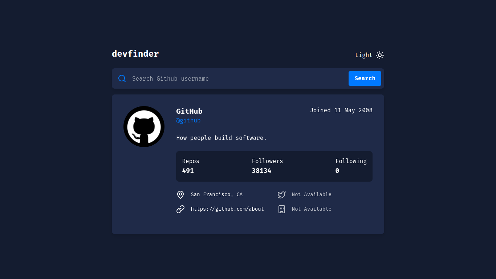

# Dev Finder

A website for checking github account information.

> :trophy: [Challenge](https://www.frontendmentor.io/challenges/github-user-search-app-Q09YOgaH6) Project from Frontend Mentor

### :hammer_and_wrench: TechStack

### :globe_with_meridians: Preview

### Features

- [x] Search for GitHub users by their username
- [x] See relevant user information based on their search
- [x] Switch between light and dark themes
- [x] View the optimal layout for the app depending on their device's screen size
